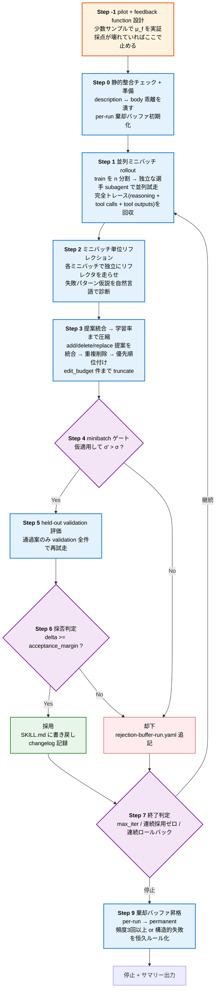

# skill-evolve

LLM エージェントに渡す **「スキル文書(SKILL.md / プロンプト / マニュアル)」を自動で進化させる** ための汎用メタスキル。

## 背景

LLM エージェントが何を出力するかは、モデル本体の賢さよりも **「どんなスキル文書(プロンプト / カンペ / マニュアル)を横に置いて作業させているか」** で大きく決まる。問題はそのスキル文書をどう育てるか。素朴に「LLM 自身に直しといて」と頼むと、自分が書いたものを自分で評価できないため、退行や肥大化を見つけられないまま「直したつもり」で終わる。

近年の研究はこの壁に対し、**スキル文書(テキスト)を学習対象のパラメータと見なし、テスト集合に対する「採点 → 編集案 → 検証 → 採用 or 却下」のループで自動進化させる** 方向に進んでいる。ニューラルネット訓練で確立された規律 — 勾配 / 学習率 / 検証セット / モメンタム / 過学習防止 — を、そのままテキスト空間に持ち込む発想だ(具体的な対応関係は次節 [キーアイデア](#キーアイデア) の対応表を参照)。

本ツールはこの系譜の代表的 2 論文を、Claude Code の subagent パターンに合うよう統合した実装である:

- **SkillOpt** — *Self-Evolving Agent Skills* (Microsoft Research Asia ほか, 2026 / https://arxiv.org/abs/2605.23904)
  - 「テキスト勾配 + held-out validation + 暴走防止」をコアに、ミニバッチ更新 / エポック単位のメタ最適化 / コーチ自身のメタプロンプト更新という多層の自己進化アーキテクチャを提案
- **GEPA** — *Reflective Prompt Evolution Can Outperform Reinforcement Learning* (ICLR 2026 Oral / https://arxiv.org/abs/2507.19457)
  - 「自然言語リフレクション + Pareto frontier + 進化的探索」でサンプル効率を稼ぐ。GRPO 比でロールアウトを約 35 倍削減

本リポジトリで「**SkillOpt 方式**」と書いてあるときは、上記 SkillOpt 論文に由来する「テキスト勾配でスキル文書を最適化するループ構造そのもの」を指す。GEPA 由来の要素(リフレクション分離・棄却バッファ・将来拡張の Pareto frontier)は SkillOpt の骨格に乗せる形で取り込まれている。

---

## 目次

- [背景](#背景)
- [概要](#概要)
- [なぜ必要か(背景)](#なぜ必要か背景)
- [処理フロー](#処理フロー)
- [詳細説明](#詳細説明)
- [入力契約](#入力契約)
- [出力アーティファクト](#出力アーティファクト)
- [いつ使うか / 使わない場面](#いつ使うか--使わない場面)
- [Red flags](#red-flags)
- [位置づけと棲み分け](#位置づけと棲み分け)
- [将来拡張](#将来拡張)
- [リポジトリ構成](#リポジトリ構成)
- [参考文献](#参考文献)

---

## 概要

### 何をするツールか

任意の `SKILL.md`(あるいはプロンプト / 業務マニュアル / カンペ)を入力として受け取り、テストケース集に対する性能を上げる方向に **少しずつ自動編集** していくメタスキル。

エージェントの精度はモデル本体の賢さよりも「どんなカンペを横に置いて作業させているか」で大きく決まる、というのが直近 1〜2 年の常識になりつつある。問題はそのカンペをどう育てるか。本ツールはこの問いに、ニューラルネット訓練と同等の規律を **テキスト空間** に持ち込むことで答える。

### キーアイデア

| ニューラルネット訓練 | skill-evolve(テキスト最適化) |
|---|---|
| 重み (parameters) | スキル文書のテキスト |
| 勾配 (gradient) | 編集案(`add` / `delete` / `replace`) |
| オプティマイザ | コーチ subagent |
| 学習率 | `edit_budget`(1 イテレーションで採用する編集の上限数) |
| 訓練データ | train ケース |
| 検証データ | validation ケース(held-out) |
| モメンタム | 棄却バッファ(過去に効かなかった編集の記憶) |
| 学習率スケジューラ | (将来拡張)エポック単位のメタ更新 |

### 何が嬉しいか

1. **自己評価バイアスの排除** — 選手・リフレクタ・コーチを別 subagent に分離。同じ LLM が「実行→評価→修正」を兼任しない
2. **過学習の防止** — held-out validation で確かに改善したケースだけ採用
3. **退行(regression)の検出** — baseline スコアを下回ったら直前の編集をロールバック
4. **長期失敗の長期記憶** — per-run / permanent の 2 層棄却バッファでセッション跨ぎの再提案を防ぐ
5. **モデル非依存** — 改善対象はテキスト 1 枚なので、Claude で磨いたものを他モデルで使ってもそのまま効く

---

## なぜ必要か(背景)

「カンペ改善くらい、AI に『直しといて』と一発で頼めば済む」と思いがちだが、実際にやると **構造的に失敗する**:

| やりがちな素朴方法 | 何がダメか |
|---|---|
| 「直しといて」と LLM に丸投げ | 自分が書いたものを自分で評価できない。**自己評価バイアス**で「直したつもり」になる |
| 「念のため書き足そう」を繰り返す | スキルが長文化。**長いスキルは読み飛ばされて**かえって精度が落ちる(肥大化バイアス) |
| 「良くなった気がする」で採用 | 別タスクで動いていた機能が壊れても気付かない(**退行混入**) |
| 同じ失敗を毎回提案させる | 学習しない。同じ案で時間と LLM コストを溶かす |

本ツールはこれら 4 つの失敗モードに、それぞれ次の構造で対処する:

- **役割分離**(選手 / リフレクタ / コーチ)→ 自己評価バイアス対策
- **編集予算 + 局所修正のみ**(`add` / `delete` / `replace`)→ 肥大化対策
- **held-out validation + 採用閾値 + ロールバック** → 退行混入対策
- **2 層棄却バッファ(per-run + permanent)** → 同一失敗反復対策

---

## 処理フロー



ループ構造は単純な **「内ループのみ」**(エポック境界やメタ最適化は v2 で別 SKILL に分離)。Step 1 〜 7 を `max_iterations` 回まで繰り返し、終了時に Step 9 で棄却バッファを昇格させる。

---

## 詳細説明

### Step -1: pilot run + feedback function 設計(必須・最重要)

**ここを飛ばすと後段は全部無駄になる。**

自動最適化の品質は採点ロジック(`feedback function μ_f`)の精度で決まる。μ_f が壊れた状態で勾配を計算しても、誤った方向にスキルが歪んでいくだけ。

実施手順:

1. test_cases から 5〜10 ケースをピックアップ
2. 対象 SKILL を手動で適用
3. rubric で採点
4. **採点結果が人間の直感と一致するか**を確認
   - 直感的に正解と思ったケースが × → 採点ロジックが間違い、rubric を修正
   - 直感的に明らかな失敗が ○ → 採点が甘い、`[critical]` を厳しくする
5. コーチへの初期メタプロンプトを下書き
6. 1〜2 イテレーションだけ手動でループを回し、編集案の妥当性を人間が確認
7. コスト試算(LLM 呼び出し数 × 単価 × 想定イテレーション)

成果物:

- `feedback_spec.md` — μ_f 仕様
- `coach_meta_prompt.md` — コーチへの初期指示(1 ファイル固定、手動更新)
- `pilot_report.md` — 数値結果 + 人間判断との一致度

### Step 0: 静的整合チェック + 準備

#### 0a. description ↔ body 整合チェック

frontmatter `description` が謳う trigger / 用途と、body のカバー範囲に乖離がないか確認。乖離があれば本ループに入る前に人間が修正(コーチが description に body を合わせる "再解釈" を防ぐ)。

#### 0b. 作業ディレクトリの準備

対象ディレクトリ直下に `.skill-opt/` を作成(無ければ)し、以下を配置:

- `baseline.md` — 起点バックアップ
- `changelog.md` — 各イテレーションの差分と採否
- `rejection-buffer-run.yaml` — per-run(各実行先頭で空に初期化)
- `rejection-buffer-permanent.yaml` — cross-session(削除厳禁)

### Step 1: 並列ミニバッチ rollout

train ケースを `n_minibatches` 個に均等分割し、各ミニバッチを **独立した選手 subagent** に並列 dispatch(単一メッセージ内で複数 Agent 呼び出し)。同 subagent は再利用しない。

回収する **完全トレース**:

| 種類 | 取り方 |
|---|---|
| 最終成果物 | subagent レポート |
| tool_uses (execution trace) | Task tool 戻り値 |
| tool_outputs (evaluation trace) | レポート内「ツール戻り値要約」 |
| reasoning | レポート「推論メモ」 |
| 不明瞭点・裁量補完 | レポート末尾 |

「成功 / 失敗の ○×」ではなく **自然言語の所見** を残すのが本手法の核心。情報量が桁違いに多い。

### Step 2: ミニバッチ単位リフレクション(並列)

各ミニバッチごとに **新規のリフレクタ subagent** を独立 dispatch。コーチとは役割を分離する。

リフレクタが出力するもの:

- 失敗パターン仮説(case ごとに何が起きていそうか)
- 共通原因(ミニバッチ内で複数 case に共通する根本原因)
- 未充足な前提(スキルが暗黙に前提していて、選手が補完しきれていない情報)
- 削除候補(冗長 / 矛盾箇所)
- `tool_uses` 偏り観察(他比 3〜5 倍以上なら構造的欠陥仮説)

精度のみで判断するとスキルの構造的欠陥が隠れる。**質的シグナルを常に主、メトリクスは補助**。

### Step 3: 提案統合 → 学習率まで圧縮

**新規のコーチ subagent** に次を渡す:

- `current_skill` 全文
- 全ミニバッチのリフレクション
- 2 層の棄却バッファ
- `coach_meta_prompt.md`
- `edit_budget` 上限

コーチが取れる手は 3 種類だけ:

| op | 何をするか |
|---|---|
| `add` | 行や段落を追加 |
| `delete` | 既存の行や段落を消す |
| `replace` | 既存の行や段落を別の文に置き換える |

**「全部書き直し」は禁止**。差分が大きすぎると、どの編集が効いたか追えなくなり、過学習や退行混入も防げない。

統合手順:

1. ミニバッチごとに提案を生成
2. 重複削除(同じ target/op はマージ)
3. 優先順位付け:複数ミニバッチで共有された問題への対処 > rationale の強さ > 単純さ
4. `edit_budget` 件まで truncate

### Step 4: minibatch ゲート

サンプル効率の核心。各編集案ごとに:

1. `current_skill` をベースに編集を仮適用したパッチ案を作る
2. 同じミニバッチ群で σ(編集前)と σ'(編集後)を測定
3. `σ' > σ` → Step 5 へ
4. `σ' ≤ σ` → 即却下、`rejection-buffer-run.yaml` 追記

validation を消費する前にここで篩い落とす。本テスト(数十問)を全案にかけると時間と費用が膨らむため、小テストで明らかにダメなものを落とす。

### Step 5: held-out validation 評価

Step 4 通過案だけ:

1. validation ケース全てに対して新規の検証 subagent で試走
2. `val_score_after_<i>` を記録
3. 同じく編集前の `current_skill` で validation 試走、`val_score_before` を記録(毎イテレーション取り直す)

### Step 6: 採否判定 と 適用

各通過案について:

- `delta_i = val_score_after_<i> - val_score_before`
- `delta_i >= acceptance_margin` なら採用候補
- 採用候補が複数なら `delta_i` 最大の 1 件のみ採用(**1 イテレーション 1 編集**)
- 採用 → `target_skill_path` に書き戻し、changelog に記録
- 不採用 → `rejection-buffer-run.yaml` に追記

### Step 7: 終了判定

次のいずれかで停止:

- `max_iterations` 到達
- 連続 2 イテレーションで採用ゼロ(頭打ち)
- 連続 2 ロールバック(構造的に自動改善が機能していない → スキル設計を疑う)

### Step 8: 安全装置

- 各イテレーション開始時、baseline との validation スコア差をチェック。**baseline を下回ったら直前の編集をロールバック**
- `edit_budget` を超える編集案は rationale の強さで truncate
- 対象 SKILL.md の上書きは Step 6 の採用確定時のみ(仮適用は別ファイル)

### Step 9: 棄却バッファの 2 層運用と昇格

実行終了時、`rejection-buffer-run.yaml` から `rejection-buffer-permanent.yaml` への昇格判定:

| 昇格条件 | 内容 |
|---|---|
| 頻度 | 過去の実行を通じて、類似編集案が **3 回以上** 却下された |
| 構造性 | リフレクタが「構造的に効かない」と明示診断 |
| 失敗モードの明確さ | 失敗モード仮説が一般化可能(名前付きパターン) |

昇格時、類似案を **クラスタリングして代表案 1 件** で記録(肥大化防止)。permanent buffer の `coach_instruction` フィールドは、以降コーチが毎回読んで **絶対遵守** する恒久ルールになる。

これが本手法の **長期資産化** の中核。スキルを長く運用するほど、バッファ自体が「このスキルでは何が効かないかのドメイン知識辞典」として育っていく。

---

## 入力契約

```yaml
target_skill_path:       <改善対象 SKILL.md の絶対パス>
test_cases_path:         <テストケース md の絶対パス>
feedback_spec_path:      <Step -1 で確定した μ_f 仕様書のパス>
coach_meta_prompt_path:  <examples/coach_meta_prompt_template.md を複製したパス>
pilot_mode: full | minimal   # minimal: 1〜2 時間で立ち上げ / full: 3〜5 時間で本格運用
max_iterations: 3            # minimal なら 2
edit_budget: 4               # 学習率
acceptance_margin: 5         # validation 改善がこのポイント以上で採用
n_minibatches: 4             # minimal なら 2
```

### test_cases_path の形式

```markdown
# Test Cases for <target skill name>

## case-01 [train]
### prompt
<対象スキルを subagent に渡し、このプロンプトを実行させる>

### rubric
- [critical] <最低ライン要件>
- <通常要件>
- <通常要件>

## case-02 [validation]
...
```

最低 **8 ケース推奨**(train 6 / validation 2)、できれば 12 ケース(train 8 / validation 4)。

---

## 出力アーティファクト

```
<target_skill ディレクトリ>/
├── SKILL.md                              ← 進化済み(本体、visible)
└── .skill-opt/                           ← skill-evolve の runtime データ
    ├── baseline.md                       ← 起点バックアップ
    ├── changelog.md                      ← 全イテレーションの採用編集 + メトリクス推移
    ├── rejection-buffer-run.yaml         ← この実行の却下案
    ├── rejection-buffer-permanent.yaml   ← 恒久的失敗パターン(削除厳禁)
    ├── feedback_spec.md                  ← Step -1 で確定した μ_f 仕様
    ├── coach_meta_prompt.md         ← コーチへのメタ指示
    └── pilot_report.md                   ← Step -1 の人間判断との一致度
```

`.skill-opt/` はドット先頭で `ls` のデフォルト表示から外れる(`.git/` と同じ慣例)。target ディレクトリ本体は SKILL.md のみを visible に保ち、他のスキルと同じ "見た目" を維持する。

---

## いつ使うか / 使わない場面

### 使うとき

- 頻繁に使われる対象スキルを継続改善したい(同じスキルを毎週叩いている等)
- 偽陽性 / 偽陰性が増えてきて再チューニングしたい
- モデル切替(例: sonnet → opus 等)で挙動が変わった
- 改善対象が複数(10+ スキル)あり、人手で運用しきれない

### 使わないとき(正直な限界)

- **1〜3 個のスキルしか扱わない** → 立ち上げコストが見合わない。人手でレビューしながら直す方が早い
- **rubric が立てられないタスク** → 採点不能 → 自動最適化は機能しない
- **1 回限りのアドホック改善** → pilot 1〜2 時間が割に合わない
- **orchestrator スキル** → 単体 SKILL 最適化とは別問題
- **新規 / 大幅改訂直後の骨格作り** → 人間が直接編集する方が速い。本ループは骨格固め後の継続改善向き

### 適用範囲マトリクス

| 状況 | 本ツール | 代替手段 |
|---|---|---|
| スキル数 1〜3、改善頻度 月 1 回未満 | △ | 人手レビュー |
| スキル数 5〜10、たまに改善 | ◯ | minimal モードで触る |
| スキル数 10+、継続改善が必要 | ◎ | これが本領 |
| 新規スキルの骨格作り | × | 人手で書く |
| rubric が曖昧 / 主観的 | × | 適用不可 |

---

## Red flags

実行中によく出てくる「合理化」とその実態:

| 出てくる合理化 | 実態 |
|---|---|
| Step -1 pilot は時間がかかるので飛ばそう | μ_f が壊れていると後段は全部無駄。**飛ばし禁止**。 |
| 選手と同じ subagent にリフレクタもコーチもやらせれば速い | 試走結果を見た当事者は客観評価できない。役割は 3 つに必ず分ける。 |
| ミニバッチ分割せず train 全件を 1 回で渡せばよくない? | 多視点集約が本手法の核心。1 視点に依存すると診断が偏る。 |
| validation も train と同じケースで良くない? | 過学習一直線。validation は train から完全分離。 |
| コーチがいい案を出したから minibatch ゲート飛ばして validation | minibatch ゲートはサンプル効率の心臓。飛ばすと validation コストが線形に増える。 |
| permanent buffer はパターン化が手間なので per-run だけで十分 | セッション跨ぎの長期失敗が再提案される。Step 9 の昇格運用は必須。 |
| edit_budget を 1 イテで 7 件にしたい | 編集ごとの寄与が混ざって測れなくなる。デフォルト 4 を超えるなら根拠を明示。 |
| 精度が baseline 下回ったが rationale は正しい | rationale の正しさと validation スコアは別物。ロールバック発動。 |
| orchestrator スキルにも本スキルを当てたい | orchestrator は別問題。別途設計が必要。 |

---

## 位置づけと棲み分け

本ツールは「人間が手で回す改善手法」を **置き換える** ものではなく、**継続改善フェーズを引き取る** ためのもの。

| フェーズ | 推奨手段 | 理由 |
|---|---|---|
| 新規スキルの骨格作り | 人間が直接編集 | 構造設計は人間の質的判断が必須 |
| 大幅改訂・構造欠陥の解消 | 人間が直接編集 | 局所修正では対処できない |
| 骨格が固まった後の継続改善 | **skill-evolve** | 自動化のメリットが効く領域 |
| 頭打ち / structural defect が貯まってきた | 人間に戻す | リフレクタが `structural` ラベルを付けるのがシグナル |

`structural_defects` が 3 件以上溜まったら、本ループを継続する前に手動で構造再編成する方が ROI が高い。本ツールはそのシグナルを定量的に出す機構として機能する。

---

## 将来拡張

本 SKILL の範囲外。別 SKILL(例: `skill-evolve-pareto`)として分離する想定。

| 拡張 | 概要 | 必要になる場面 |
|---|---|---|
| エポック単位メタ最適化 | コーチのメタプロンプト自体をエポック境界で更新 | 同じスキルを何ヶ月も継続改善するとき |
| multi-task Pareto frontier | 候補プールを Pareto frontier で管理 | 局所最適に頻繁にハマる場面 |
| System Aware Merge | 2 候補の良いとこ取りで新候補を作る genetic crossover | 系統樹分岐後の統合 |
| multi-objective Pareto(デプロイ選択) | 精度 / 簡潔さ / 安定性 / tool_economy の 4 軸 Pareto | 用途別に最適候補を選ぶ |

本 SKILL で `rejection-buffer-permanent.yaml` と `coach_meta_prompt.md` を蓄積しておくと、v2 移行時の入力として活用できる。

---

## リポジトリ構成

```
skill-evolve/
├── README.md                          ← このファイル
├── USAGE.md                           ← 実務手順(Phase A〜D + 裏技 Tips)
├── SKILL.md                           ← 本体(.claude/skills/ にコピーして使う)
└── examples/
    ├── pilot-template.md              ← Step -1 起動キットの汎用テンプレート
    └── coach_meta_prompt_template.md  ← コーチ subagent へのドメイン依存メタプロンプト雛形
```

### 使い方(クイックスタート)

1. 本リポジトリの `SKILL.md` を、対象プロジェクトの `.claude/skills/skill-evolve/SKILL.md` にコピー
2. `examples/pilot-template.md` を雛形に Step -1 を実施(`feedback_spec.md` / `pilot_report.md` を作成)
3. `examples/coach_meta_prompt_template.md` を複製して `coach_meta_prompt.md` を作成、ドメイン前提を埋める
4. test_cases を準備(`pilot_mode: minimal` なら 6 ケース、`full` なら 12 ケース)
5. Claude Code から本スキルを起動し、入力契約 YAML を渡す

---

## 参考文献

- **SkillOpt: Executive Strategy for Self-Evolving Agent Skills** (Yifan Yang et al., 2026) — https://arxiv.org/abs/2605.23904
  - テキスト勾配 + 検証セット + 暴走防止 + 3 層構造(ミニバッチ更新 / エポック単位のメタ最適化 / コーチ自身のメタプロンプト更新)
- **GEPA: Reflective Prompt Evolution Can Outperform Reinforcement Learning** (ICLR 2026 Oral) — https://arxiv.org/abs/2507.19457
  - 自然言語リフレクション + Pareto frontier + 進化的探索 + サンプル効率(GRPO 比 35x ロールアウト削減)
